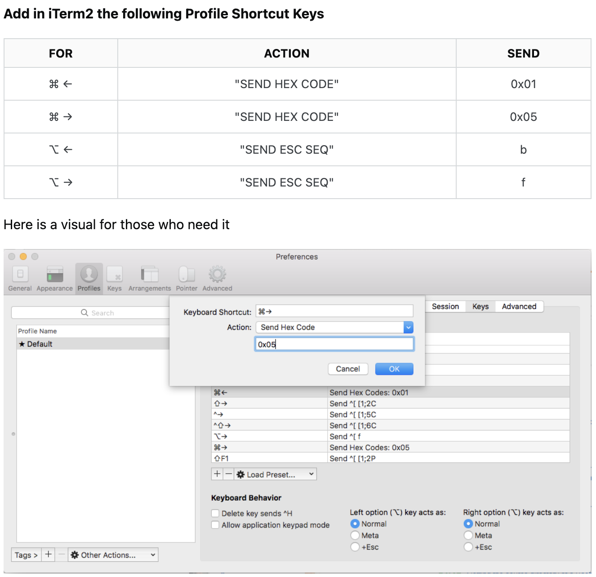

# General Computer Setup

# asdf

# [bash-cli-help](https://github.com/lpremuda/bash-cli-help)

# Docker Desktop

# Evernote

# Homebrew

# [iTerm2](https://iterm2.com/)

### [How to Set Keyboard Shortcuts](https://stackoverflow.com/questions/6205157/how-to-set-keyboard-shortcuts-to-jump-to-beginning-end-of-line)

Go to iTerm2 >> Settings... >> Profiles >> Keys >> Key Mappings. See screenshot below:



To make `⌘ ←` and `⌘ →` work in Intellij terminal, add the following to your `~/.zshrc` file:

```bash
bindkey "\e\eOD" beginning-of-line
bindkey "\e\eOC" end-of-line
```

# [Nodejs](https://nodejs.org/en)

`npm` and `npx` get installed along with Nodejs.

Installed via `asdf`:

```bash
asdf plugin add nodejs
asdf install nodejs 20.11.0
```

Previous Releases: https://nodejs.org/en/about/previous-releases

# [oh-my-zsh](https://ohmyz.sh/)

Setup: https://gist.github.com/n1snt/454b879b8f0b7995740ae04c5fb5b7df

# [neovim](https://neovim.io/)

### Install:

```sh
brew install neovim
```

Note: remember to install NvChad (see below).

## [NvChad](https://nvchad.com/)

### Install:

1. Run this command:
```sh
git clone https://github.com/NvChad/starter ~/.config/nvim && nvim
```

2. Run `:MasonInstallAll` command after lazy.nvim finishes downloading plugins.

3. Delete the .git folder from nvim folder.

### Open Theme Switcher menu:

Within nvim, `<Spacebar> + t + h`.

### Use `jk` or `kj` to escape:

- To add `<jk>`/`<kj>` to `<Escape>` mapping, add the following to `${HOME}/.config/nvim/lua/mappings.lua` (Reference doc: https://nvchad.com/docs/config/mappings):

```lua
map("i", "jk", "<ESC>")
map("i", "kj", "<ESC>")
```

# [Postgresql](https://www.postgresql.org/)

Installed via `brew`:

```bash
brew install postgresql@16
echo 'export PATH="/opt/homebrew/opt/postgresql@16/bin:$PATH"' >> ~/.zshrc
```

The `echo` command above is because you get the following message when you install `postgresql@16`:

```bash
postgresql@16 is keg-only, which means it was not symlinked into /opt/homebrew,
because this is an alternate version of another formula.
```

# Postman

# [Python](https://www.python.org/)

Version installed: 3.11.7

Installed via `brew`:

```bash
brew install python
```

Interpreter path: `/opt/homebrew/bin/python3`

Add the following to `~/.zshrc`:

```bash
alias python=/opt/homebrew/bin/python3
```

# [Rectangle](https://rectangleapp.com/)

### Post-installation:

1. Open Rectangle in the MacOS menu bar.
2. Click on `Settings...`.
3. Check the `Launch on login` checkbox.

# VSCode

### Extensions

- Auto Rename Tag
- [Docker](https://marketplace.visualstudio.com/items?itemName=ms-azuretools.vscode-docker)
- [GitLens](https://marketplace.visualstudio.com/items?itemName=eamodio.gitlens)
- [markdownlint](https://marketplace.visualstudio.com/items?itemName=DavidAnson.vscode-markdownlint)
- [Prettier - Code formatter](https://prettier.io/)
- [VSCode Neovim](https://marketplace.visualstudio.com/items?itemName=asvetliakov.vscode-neovim) (UNINSTALLED because it doesn't support `<kj>` to `<Escape>` mapping)

    1. Had to go into Extension Settings and set `Vscode-neovim > Neovim Executable Paths: Darwin` to the full path of the `nvim` binary, i.e. `/opt/homebrew/bin/nvim`.

- [Vim](https://marketplace.visualstudio.com/items?itemName=vscodevim.vim)

    1. Ensure the following is added to `settings.json` file (i.e. Shift + Command + P and open `Preferences: Open User Settings (JSON)`)

```json
{
    "vim.insertModeKeyBindings": [
        {
            "before": ["j", "k"],
            "after": ["<esc>"]
        },
        {
            "before": ["k", "j"],
            "after": ["<esc>"]
        }
    ]
}
```
